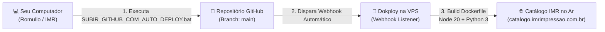

# ⚡ GUIA COMPLETO: CONFIGURAÇÃO DE AUTO-DEPLOY NO DOKPLOY VIA GITHUB
### IMR Impressão 3D — Catálogo Digital Fullstack & Motor Bambu Lab

---

## 🎯 Objetivo

Configurar o pipeline de **Auto-Deploy Contínuo (CI/CD)** para que, a cada alteração salva ou novo produto adicionado, basta executar o script ou dar um `git push` para que o **Dokploy** receba o aviso, faça o build automático do Docker e coloque a versão atualizada no ar em menos de 2 minutos, sem necessidade de acessar a VPS manualmente.



---

## 🚀 PASSO 1: Subir o Projeto para o seu GitHub

Toda a automação já foi criada para você. Na sua **Área de Trabalho**, existe o atalho:

👉 **`SUBIR_GITHUB_COM_AUTO_DEPLOY.bat`**

1. Dê um duplo clique no arquivo **`SUBIR_GITHUB_COM_AUTO_DEPLOY.bat`**.
2. Se for a primeira vez:
   - O assistente solicitará a URL do seu repositório no GitHub.
   - Se ainda não criou, acesse [https://github.com/new](https://github.com/new).
   - Crie o repositório com o nome `catalogo-imr` ou `imr-catalogo` (Público ou Privado).
   - **Importante:** Deixe desmarcada a opção *"Add a README file"*.
   - Copie o link HTTPS (exemplo: `https://github.com/SEU_USUARIO/catalogo-imr.git`) e cole no assistente.
3. O script cuidará de tudo:
   - Adiciona todos os arquivos (`git add -A`).
   - Cria o commit com mensagem descritiva.
   - Envia para a branch `main` (`git push -u origin main`).
   - Se for o primeiro acesso, o navegador abrirá para autorização rápida pelo Windows Git Credential Manager.

---

## 🔑 PASSO 2: Como Pegar o Webhook no Dokploy

O Dokploy gera uma URL única de Webhook para cada aplicação. Para obtê-la:

1. Acesse o painel web do seu Dokploy no navegador (ex: `http://IP_DA_SUA_VPS:3000` ou pelo domínio do seu Dokploy).
2. No menu lateral, clique em **Projects** e selecione o projeto **`IMR Impressão`**.
3. Clique na aplicação do catálogo: **`imr-catalogo`**.
4. No menu superior da aplicação, localize e clique na aba **Deployments** (ou na seção **Auto Deploy**).
5. Você verá o campo:
   ```text
   Auto Deploy / Webhook URL
   https://dokploy.seudominio.com/api/deploy/webhook/a1b2c3d4-e5f6-7890-abcd-ef1234567890
   ```
6. Clique no botão de **Copiar** (ícone de prancheta) ao lado da URL. Guarde essa URL!

---

## 🔗 PASSO 3: Conectar o Webhook no GitHub (Escolha uma das Opções)

Você pode configurar das duas formas abaixo. A **Opção A** é a mais rápida e nativa:

### ⭐ OPÇÃO A: Webhook Nativo do Repositório (Mais Rápido e Recomendado)

1. Abra o seu repositório no GitHub no navegador:
   `https://github.com/SEU_USUARIO/catalogo-imr`
2. Clique na aba **Settings** (ícone de engrenagem no topo do repositório).
3. No menu lateral esquerdo, clique em **Webhooks**.
4. Clique no botão verde **Add webhook** (canto superior direito).
5. Preencha o formulário exatamente assim:
   - **Payload URL**: Cole a URL do webhook copiada do Dokploy no Passo 2.
   - **Content type**: Altere para **`application/json`**.
   - **Secret**: Deixe em branco (o Dokploy já autentica pelo token da URL).
   - **SSL verification**: Deixe marcado `Enable SSL verification`.
   - **Which events would you like to trigger this webhook?**:
     Selecione **Just the push event** (Apenas eventos de push).
   - **Active**: Certifique-se de que a caixinha esteja **marcada ✅**.
6. Clique no botão verde **Add webhook** no final da página.
7. **Confirmação imediata:** O GitHub enviará um teste ("ping"). Um ícone de visto verde (✔) aparecerá ao lado do webhook, confirmando que a comunicação com o Dokploy está 100% ativa!

---

### 🛡️ OPÇÃO B: Via GitHub Actions Workflow (Monitorado com Logs no GitHub)

O projeto já inclui o arquivo pré-configurado:
`.github/workflows/dokploy-autodeploy.yml`

Para que ele funcione:
1. No seu repositório GitHub, clique em **Settings**.
2. No menu lateral esquerdo, vá em **Secrets and variables** -> clique em **Actions**.
3. Clique no botão **New repository secret**.
4. Preencha os campos:
   - **Name**: `DOKPLOY_WEBHOOK_URL`
   - **Secret**: Cole a URL do webhook copiada do Dokploy.
5. Clique em **Add secret**.
6. A partir de agora, toda vez que fizer um push na branch `main`:
   - A aba **Actions** do GitHub executará o workflow.
   - Ela fará a chamada POST para o Dokploy e registrará os logs e tempo de resposta diretamente no painel do GitHub!

---

## 📋 Resumo das Configurações da Aplicação no Dokploy

Para garantir que o Docker rode com perfeição na VPS, certifique-se de que a aplicação no Dokploy esteja configurada com os seguintes parâmetros:

| Configuração | Valor Recomendado | Onde Configurar no Dokploy |
| :--- | :--- | :--- |
| **Provider** | GitHub / Git | Aba *Source* |
| **Repository** | `https://github.com/SEU_USUARIO/catalogo-imr.git` | Aba *Source* |
| **Branch** | `main` | Aba *Source* |
| **Build Type** | **`Dockerfile`** | Aba *Source* |
| **Dockerfile Path** | `./Dockerfile` | Aba *Source* |
| **Container Port** | `3000` | Aba *General* |
| **Volumes / Mounts** | Host: `uploads_data` -> Container: `/app/uploads` | Aba *Volumes* |
| **Environment Vars** | `NODE_ENV=production`<br>`PORT=3000`<br>`PYTHON_PATH=python3` | Aba *Environment* |
| **Domínio Próprio** | `catalogo.imrimpressao.com.br` (SSL Let's Encrypt ativo) | Aba *Domains* |

---

## ✅ Como Saber que o Site Está no Ar

Assim que o deploy for acionado (pelo Webhook ou pelo botão Deploy no Dokploy):

1. **Acompanhar no Dokploy:**
   - Na aba **Deployments**, você verá o status mudar de `Building` -> `Deploying` -> `Done`.
   - Na aba **Logs**, você verá a mensagem:
     ```text
     ====================================================
      IMR Impressao 3D - Catalogo & Orcamento Online
      Servidor rodando em: http://0.0.0.0:3000
      Modo: production
      Uploads salvos em: /app/uploads
      Motor 3D Python: Ativo e pronto
     ====================================================
     ```

2. **Testar no Navegador:**
   - Acesse o endereço configurado: `https://catalogo.imrimpressao.com.br`
   - Teste a rota de diagnóstico de saúde:
     `https://catalogo.imrimpressao.com.br/api/health`
     Deve responder:
     ```json
     {
       "status": "online",
       "message": "Servidor IMR Impressão 3D operacional",
       "python": {
         "available": true,
         "version": "Python 3.11.x"
       }
     }
     ```

---

## 🛠️ Como Atualizar o Catálogo no Dia a Dia

Sempre que você:
- Adicionar novas fotos ou modelos 3D STL;
- Ajustar preços no calculador de orçamentos Bambu Lab;
- Criar novas páginas ou alterar textos:

**Passo único:**
Dê um duplo clique no atalho da Área de Trabalho **`SUBIR_GITHUB_COM_AUTO_DEPLOY.bat`**.

O script envia as alterações e o **Dokploy atualiza o site na nuvem sozinho**, sem você precisar fazer mais nada! 🚀

---

*IMR Impressão 3D — Engenharia de Infraestrutura e Automação Cloud*  
*Curitiba, PR*
